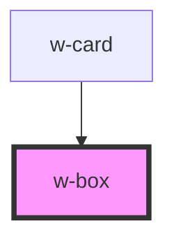

# w-box

<!-- Auto Generated Below -->

## Properties

| Property  | Attribute | Description | Type                              | Default     |
| --------- | --------- | ----------- | --------------------------------- | ----------- |
| `padding` | `padding` |             | `"default" \| "large" \| "small"` | `'default'` |

## Dependencies

### Used by

 - [w-card](../w-card)

### Graph

----------------------------------------------

*Built with [StencilJS](https://stenciljs.com/)*
