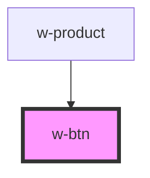

# w-btn

<!-- Auto Generated Below -->

## Properties

| Property    | Attribute    | Description | Type                                    | Default     |
| ----------- | ------------ | ----------- | --------------------------------------- | ----------- |
| `color`     | `color`      |             | `"default" \| "primary" \| "secondary"` | `'default'` |
| `fullWidth` | `full-width` |             | `boolean`                               | `false`     |
| `size`      | `size`       |             | `"large" \| "medium" \| "small"`        | `'medium'`  |
| `variant`   | `variant`    |             | `"contained" \| "outlined" \| "text"`   | `'text'`    |

## Dependencies

### Used by

 - [w-product](../w-product)

### Graph

----------------------------------------------

*Built with [StencilJS](https://stenciljs.com/)*
