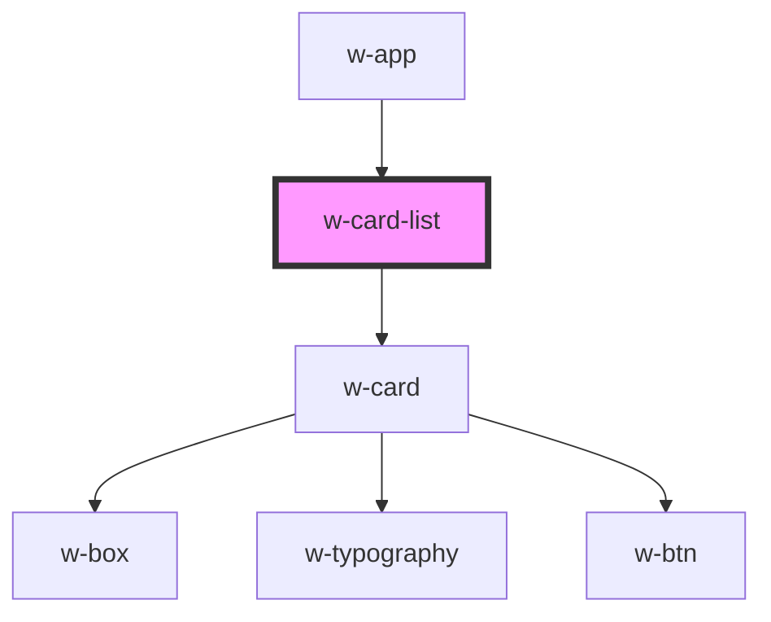

# w-card-list

<!-- Auto Generated Below -->

## Properties

| Property | Attribute | Description | Type      | Default     |
| -------- | --------- | ----------- | --------- | ----------- |
| `cards`  | --        |             | `ICard[]` | `undefined` |

## Dependencies

### Used by

 - [w-app](../w-app)

### Depends on

- [w-card](../w-card)

### Graph

----------------------------------------------

*Built with [StencilJS](https://stenciljs.com/)*
