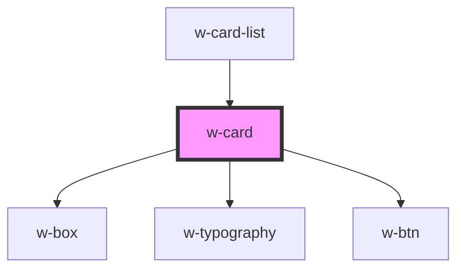

# w-card

<!-- Auto Generated Below -->

## Properties

| Property | Attribute | Description | Type    | Default     |
| -------- | --------- | ----------- | ------- | ----------- |
| `card`   | --        |             | `ICard` | `undefined` |

## Events

| Event       | Description | Type                 |
| ----------- | ----------- | -------------------- |
| `addToCard` |             | `CustomEvent<ICard>` |
| `addToList` |             | `CustomEvent<ICard>` |

## Dependencies

### Used by

 - [w-card-list](../w-card-list)

### Depends on

- [w-box](../w-box)
- [w-typography](../w-typography)
- [w-btn](../w-btn)

### Graph

----------------------------------------------

*Built with [StencilJS](https://stenciljs.com/)*
