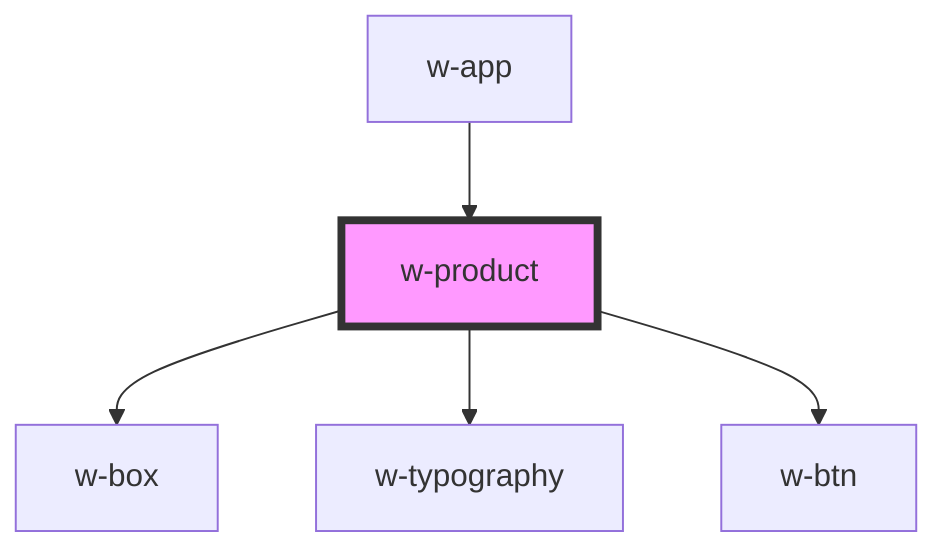

# w-product

<!-- Auto Generated Below -->

## Properties

| Property  | Attribute | Description | Type       | Default     |
| --------- | --------- | ----------- | ---------- | ----------- |
| `product` | --        |             | `IProduct` | `undefined` |

## Events

| Event       | Description | Type                    |
| ----------- | ----------- | ----------------------- |
| `addToCard` |             | `CustomEvent<IProduct>` |
| `addToList` |             | `CustomEvent<IProduct>` |

## Dependencies

### Used by

 - [w-app](../w-app)

### Depends on

- [w-box](../w-box)
- [w-typography](../w-typography)
- [w-btn](../w-btn)

### Graph

----------------------------------------------

*Built with [StencilJS](https://stenciljs.com/)*
