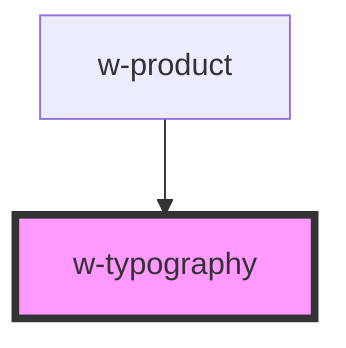

# w-typography

<!-- Auto Generated Below -->

## Properties

| Property  | Attribute | Description | Type                                           | Default |
| --------- | --------- | ----------- | ---------------------------------------------- | ------- |
| `variant` | `variant` |             | `"h1" \| "h2" \| "h3" \| "h4" \| "h5" \| "h6"` | `'h1'`  |

## Dependencies

### Used by

 - [w-product](../w-product)

### Graph

----------------------------------------------

*Built with [StencilJS](https://stenciljs.com/)*
